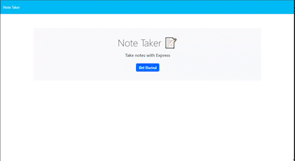
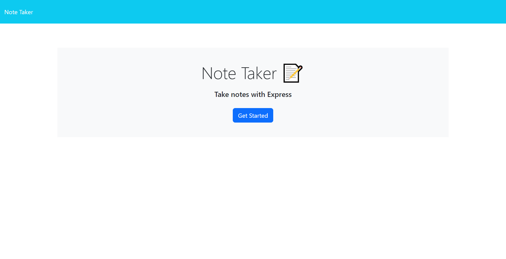
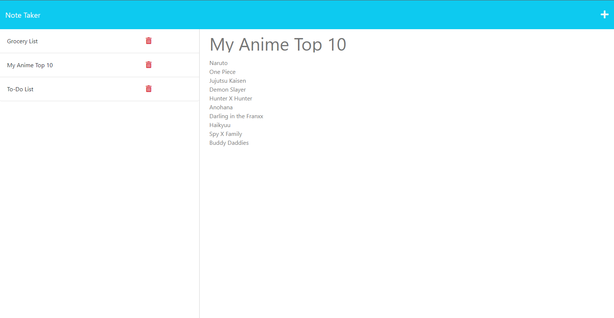

# Express Note-Taking App
  ## Description 
  An app that allows you to write, save, and delete any notes you need!
  ## Table of Contents
  * [Installation](#installation)
  * [Usage](#usage)
  * [Screenshots](#Screenshots)
  * [License](#license)
  * [Contributing](#contributing)
  * [Tests](#tests)
  * [Questions](#questions)
  
  ## Installation 
  requires Express, and UUID use "npm i express" and "npm i uuid" to install them
  ## Usage 
  
  
  Click on the Get Started button then simply add any notes you want. Click on the save button in the top right to save your notes, then if you want to delete any notes just click on the red trash-can next to your saved note.

  ## Screenshots 
  
  
  ## License 
  This project is license under MIT
  ## Contributing 
  contact me through email.
  ## Tests
  n/a
  ## Questions
  If you have any questions about this projects, please contact me directly at phelms1999@gmail.com. You can view more of my projects at https://github.com/reignbtw.